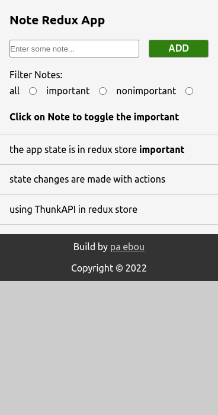
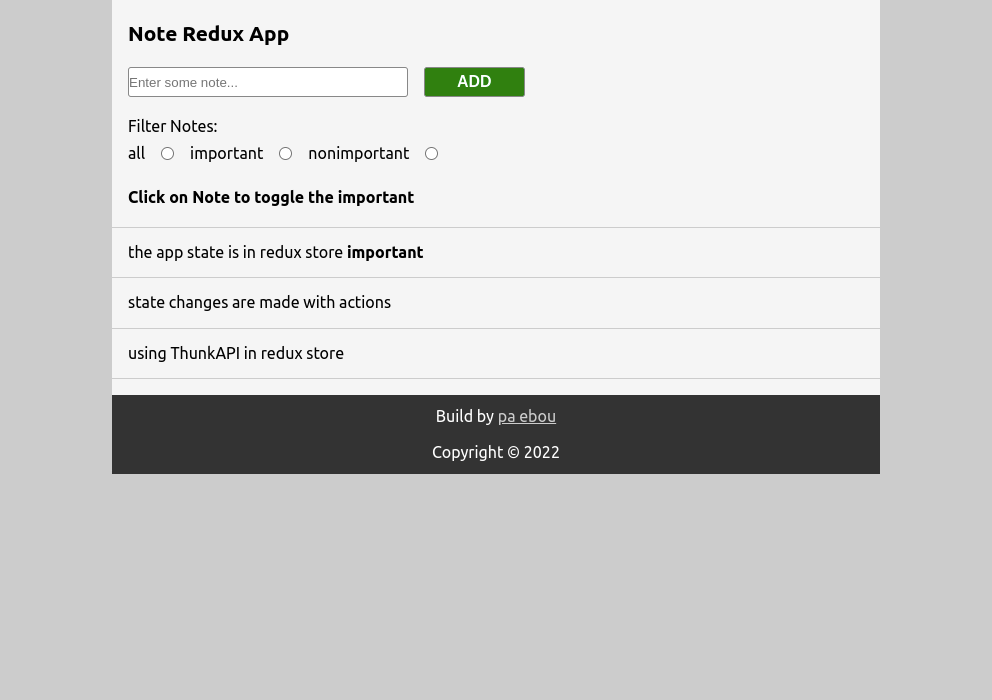

# Note Reducer App

Note app build with create-reat-app , state management is handle with react-redux and redux-tool-kit

## Notes:

* write a new note in the form and click on the add button. 
* Every note has two state: important and none-important
* The state of the note can be change by clicking on the on note either to 
* Every note by default important will be false,  
* Clicking on the note will change the important to true and false vise-vice
* Note can be filtered by selecting the radio button. By default all notes will be show
* Important will only show the notes that has `important: true` 
* non-important will show the `important: true` 

## Preview

Mobile view:

Laptop and More 

[Demo]()
